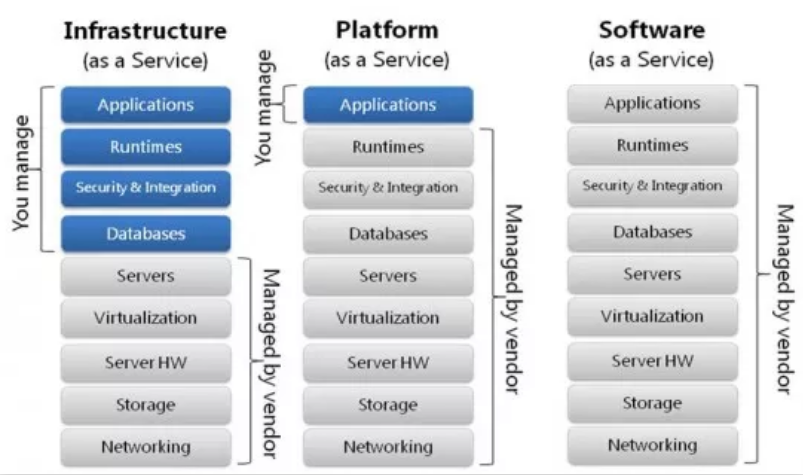
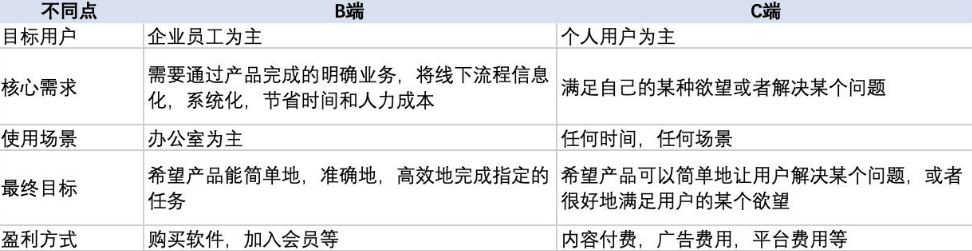

# 专业术语
在这里主要记录学习过程中遇到的部分专业术语/概念

## 1. SaaS/PaaS/IaaS
越来越多的软件开始采用云服务，并且如果决定**外包**一部分工作

云服务模式可分为三大类：**SaaS/PaaS/IaaS**

+ SaaS（Software-as-a-Service）

    意为软件即服务，即通过网络提供**软件服务**。SaaS平台供应商将应用软件统一部署在自己的服务器上

    软件的开发、管理、部署都交给第三方，不需要关心技术问题，可以拿来即用

+ PaaS（Platform-as-a-Service）

    意为平台即服务，把服务器平台作为一种服务提供的商业模式。在云计算时代相应的**服务器平台**或者**开发环境**作为 服务 进行提供

    开发者只需要关注自己的业务逻辑，不需要关注底层的系统基础设施

+ IaaS（Infrastructure as a Service）

    意为基础设施即服务，消费者通过网络可以从完善的**计算机基础设施**获得服务，主要提供一些基础资源

## 2. B端/C端
+ B端和C端的定义

B全称是Business，即商家/企业的产品，为工作或商业目的而使用的系统软件/工具/平台。例如阿里云/腾讯云/企业内部的ERP系统，企业资源计划（Enterprise Resource Planning）

C全称是Customer，即消费者/用户的产品，个人用户或终端产品，例如微信/抖音/微博等客户端

+ 相同点：
    
    1. 用户都是人，都是人在使用这些产品
    2. 都需要考虑商业价值和用户体验之间的平衡
    3. 产品设计的核心都是围绕“在什么场景下为怎样的用户（客户）采取什么方法解决哪些问题”

+ 不同点：

    

    B端是为了工作而生，业务功能为主
    
    C端是面向用户，明确设计目标