# 操作系统的概念和定义
## 1.操作系统的概念
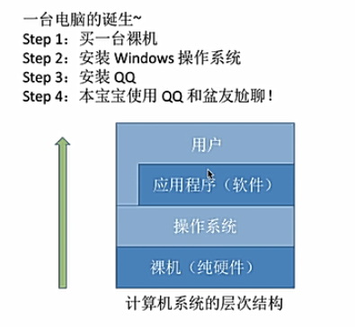
1. 用户：用户可以使用应用程序，也可以直接和操作系统进行交互
2. 应用程序，即软件： 比如qq，浏览器，英雄联盟等
3. 操作系统：如windows，android，linux等
4. 裸机，即纯硬件：比如CPU，内存，硬盘

### 操作系统的定义：
1. 负责管理/协调/分配硬件和软件资源

    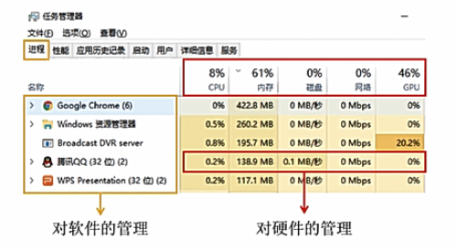
2. 为上层的应用程序/用户提供简单易用的服务（接口和环境）
3. 操作系统是**覆盖在硬件上的第一层系统软件**，不是硬件

### 操作系统的功能
1. 作为系统资源的管理者

    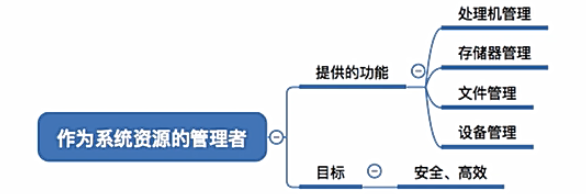
2. 作为用户和计算机硬件之间的接口

    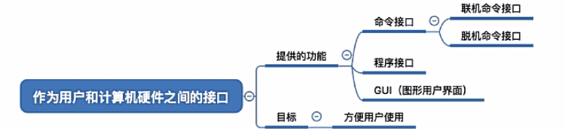

    + 命令接口：允许用户直接使用的接口
        + 联机命令接口/交互式命令接口：用户说一句，系统做一句（win+R+cmd）
        + 脱机命令接口/批处理命令接口：用户说一堆，系统做一堆（C盘中的*.bat文件）
    + 程序接口/系统调用：允许用户通过程序间接使用，在编程时可以调用，由一组系统调用组成（比如.dll文件）
    + GUI（图形用户界面）：现代操作系统中最流行的图形用户接口
3. 实现对硬件机器的拓展

    裸机： 没有任何软件支持的计算机
    
    虚拟机：覆盖了软件的机器称为扩充机器/虚拟机

### 操作系统的目标
1. 使计算机系统更易使用
2. 执行用户程序并使用户问题更易解
3. 以一种高效率的方式使用硬件

## 2.操作系统的特征
### 操作系统的四个特征
+ 并发
+ 共享
+ 虚拟
+ 异步

其中并发和共享是两个最基本特征，二者互为存在条件

### 1. 并发
+ 并发是指两个或多个事件在**同一时间间隔**内发生，这些事件宏观上是同时发生的，但微观上是**交替发生的**

+ 易混概念：并行，是指两个或多个事件在**同一时刻**同时发生

+ 操作系统的并发性是指计算机系统中同时存在多个运行着的程序，操作系统会负责协调多个程序交替执行

+ 操作系统和程序并发是一起诞生的，尽管当今的计算机一般都是多核CPU，但是并发性依旧必不可少

### 2. 共享
+ 共享即资源共享，是指系统中的**资源**可供内存中多个并发执行的进程共同使用

+ 两种资源共享方式：
    1. 互斥共享方式
    2. 同时共享方式
    
    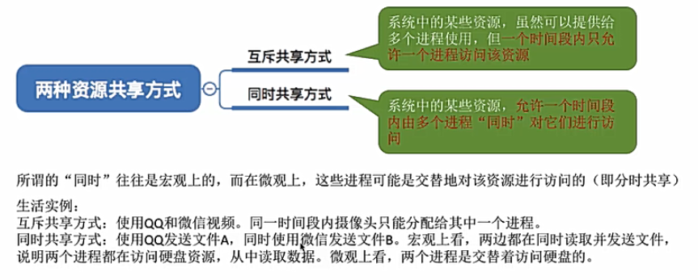
    
#### 并发和共享的关系
并发性是指计算机系统中有多个进程“同时”执行

共享性是指系统中的资源可供内存中多个并发执行中的进行共同使用

+ 若系统失去并发性，则共享性失去了存在的意义

+ 若系统失去共享性，则无法实现并发执行

**并发和共享是互为存在条件的**

### 3.虚拟
+ 虚拟是指把一个物理上的实体变为若干个逻辑上的对应物，物理实体是实际存在的，而逻辑上的对应物是用户感受到的

+ 虚拟技术在操作系统中很普遍：例如虚拟存储器/内存技术（空分复用技术），虚拟处理器/CPU技术（时分复用技术）

举个栗子：

注意：没有并发性就没有虚拟性的必要

### 4.异步性
+ 异步是指在多道程序环境下，允许多个程序并发执行，但由于资源有限，进程的执行不是一贯到底的，而是**走走停停**，以不可知的速度向前推进

注意： 只有系统拥有并发性，才有可能导致异步性

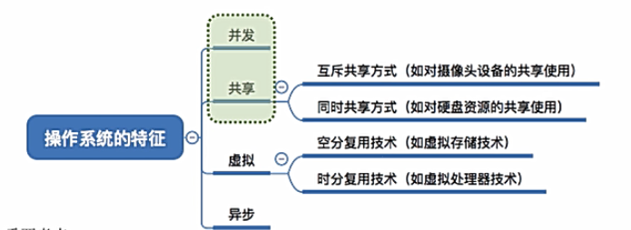

## 3.操作系统的发展与分类
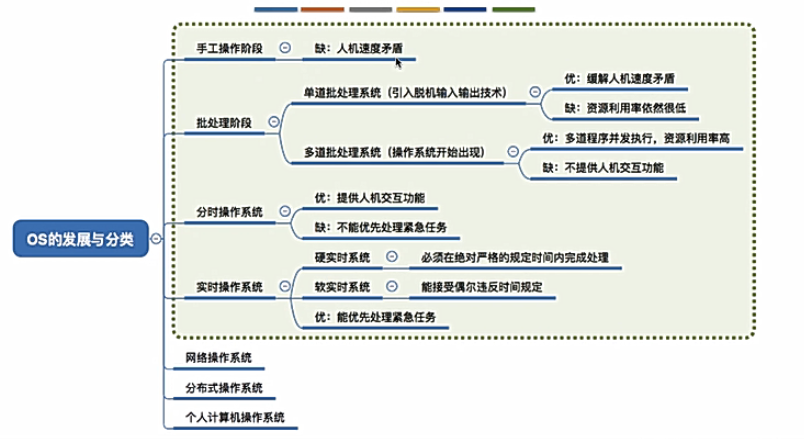
### 1.手工操作阶段
计算机可以识别二进制的01码，在这个阶段程序员是在纸袋上进行打孔

纸袋的输入输出速度慢，计算机的处理速度快

主要缺点：
1. 用户独占全机
2. **人机速度矛盾**导致资源利用率极低

### 2.批处理阶段-单道批处理
引入脱机输入/输出技术（用磁带完成），并由监督程序负责控制作业的输入和输出（监督程序就是操作系统的雏形）

脱机输入输出：程序员提前将纸袋输入速度比纸袋机快很多的磁带中，用磁带作为输入输出的中介，IO操作无需在主计算机上运行

主要优点：
+ 一定程度上缓解了人机速度的矛盾
+ 资源利用率有所提升

主要缺点：内存中仅能有一道程序运行，只能串行执行，但是CPU仍有大量的时间是在空闲等待I/O完成

### 3.批处理阶段-多道批处理
内存中同时输入多道程序（作业），使之**并发执行**

这个时候**操作系统正式诞生**，并且引入了**中断**技术，由操作系统负责管理这些程序的运行

主要优点：
+ 多道程序并发执行，共享计算机资源
+ 计算机的资源利用率大幅提升，CPU和其他资源保持“忙碌”状态，系统吞吐量/利用率增大

主要缺点：
+ 用户响应时间长
+ 没有人机交互功能（用户不能控制自己的作业执行，只能等待计算机处理完成）

### 4.分时操作系统
计算机以**时间片为单位**轮流为各个用户/作业服务，各个用户/作业可通过终端与计算机进行交互

主要优点：
+ 用户请求可以在分配到的时间片内被及时响应，解决人机交互问题
+ 独占性

主要缺点：不能优先处理一些紧急任务，即操作系统对各个用户/作业都是公平的

### 5.实时操作系统
主要优点：能够**优先响应一些紧急任务**，某些紧急任务不需时间片排队

主要特点：及时性和可靠性

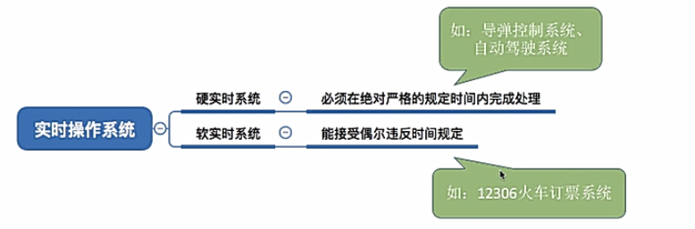

## 4.操作系统的运行机制与体系结构

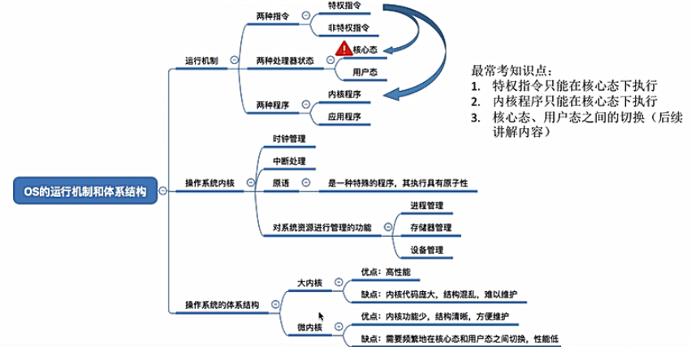

### 1.两种指令，两种处理器状态，两种程序
指令是指示计算机执行某种操作的命令，它由一串**二进制数码**组成

指令就是CPU能够识别和执行的最基本命令

一行代码能够翻译成多条指令

两种指令：
1. 非特权指令： 如普通的运算指令
2. 特权指令：如内存清零指令，不允许用户程序来使用

当CPU执行指令前，会判断是否可以执行特权指令

所以规定了两种处理器状态：
1. 用户态（目态）：CPU只能执行非特权指令
2. 核心态（管态）：CPU可以执行特权&非特权指令

两种处理器状态是用**程序状态字寄存器**（PSW）中的某标志位来标识当前处理器处于什么状态，如0表示用户态，1表示核心态

有的程序需要使用特权指令，有的程序只需要使用非特权指令，所以程序分为：
1. 内核程序：操作系统的内核程序是系统的管理者，**既可执行非特权，也能执行特权**
2. 应用程序：为了保证系统能安全运行，普通应用程序只能执行非特权指令，处于用户态

问题：操作系统中那些功能应该由内核程序实现呢？

### 2.操作系统的内核
**内核**是计算机上配置的底层软件，是操作系统最基本最核心的部分，实现操作系统内核功能的那些程序就是内核程序

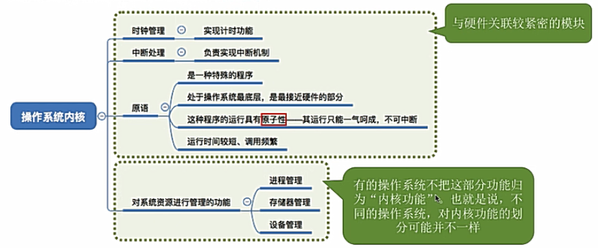

操作系统的体系结构分类：根据内核中的功能来划分
1. 大内核：包含对系统资源进行管理的功能纳入内核，称为大内核
2. 微内核：只包含时钟管理，中断处理，原语（最基本必不可少的功能）

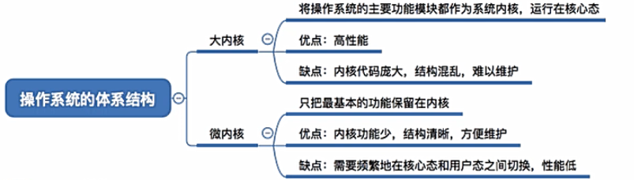

## 5.中断和异常

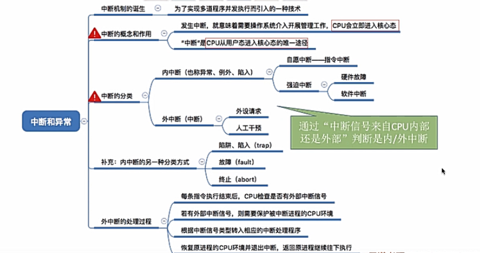

### 1.中断机制
在多道批处理阶段，发明了操作系统（作为计算机管理者），引入中断机制，实现多道程序并发执行

本质：只要发生了中断就意味着需要**操作系统介入**，开展管理工作

+ 当中断发生时，CPU立即进入核心态
+ 当中断发生后，当前运行的进程暂停运行，并由os内核中的**中断处理程序**对中断进行处理
+ 对于不同中断信号，会进行不同的处理

所以，中断可以使CPU从用户态切换为核心态，使得操作系统获得计算机的控制权，有了中断，才能实现多道程序并发执行

### 2.用户态和核心态的切换
+ 用户态--->核心态：使用中断（唯一途径）
+ 核心态--->用户态：特权指令使程序状态字的标志位设置为用户态

### 3.中断的分类
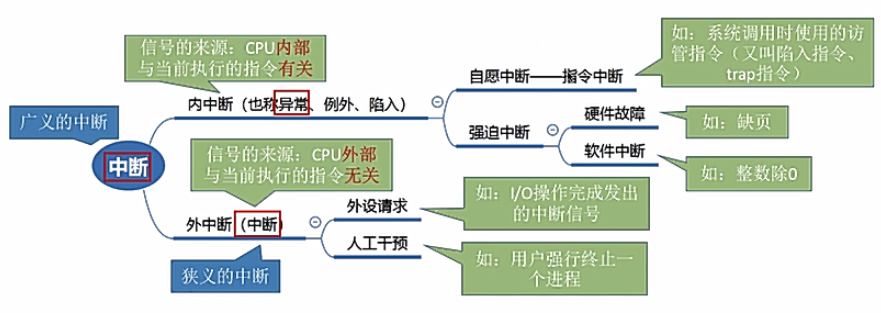

## 6.系统调用
### 1.系统调用
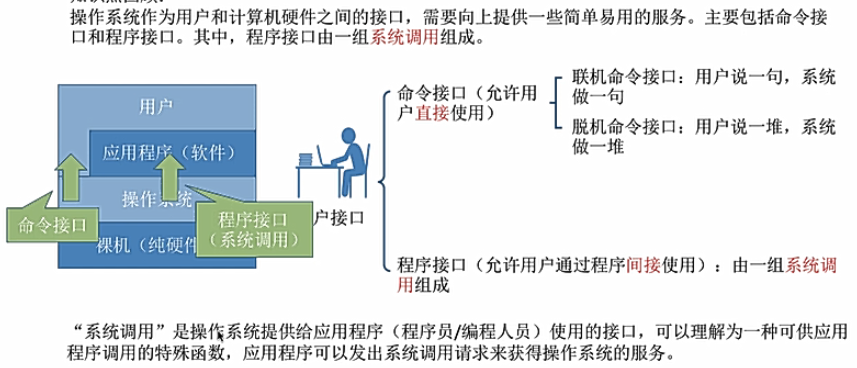

操作系统提供系统调用功能，用户进程想要使用某些资源/执行某些指令/请求操作系统的服务，只能通过**系统调用**向操作系统发出请求，操作系统会对各个请求进行协调和管理，由操作系统代为完成

系统调用能够保证系统的稳定性和安全性，防止用户进行非法操作

**系统调用的相关处理需要在核心态下进行**

### 2.系统调用和库函数的区别
**库函数是对系统调用的进一步封装**

如今，应用程序使用高级语言（C/JAVA等）提供的库函数进行程序编写

但是最后这些库函数会被编译成一些系统调用的汇编语言（将系统调用封装成库函数，以隐藏系统调用的一些细节）

**库函数不一定会涉及系统调用**

### 3.系统调用的背后过程
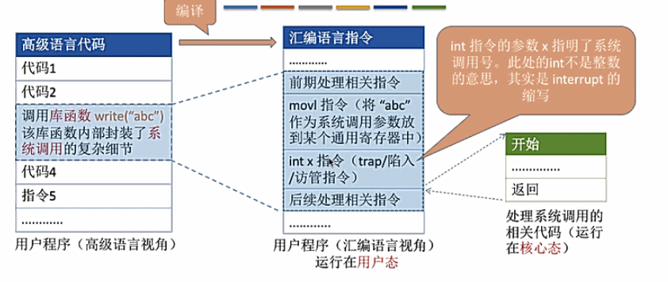

操作系统通过int（interrupt）后的调用号码来确定执行的系统调用

传递系统调用参数->执行陷入指令(用户态)->执行系统调用相应服务程序（内核态）->返回用户程序

发出系统调用请求是在用户态，而对系统调用的相应处理在核心态下进行

