# 进程
## 进程的定义，组成，组织方式和特征
### 1.进程与程序的区别
+ 程序：一个指令序列  --- **静态的**
+ 进程：进程就是运行着的程序，是程序的一次执行过程  --- **动态性**

进程的引入是为了方便操作系统管理，完成各程序并发执行

系统为每个运行的程序（即进程）配置一个数据结构，称为**进程控制块**(PCB)，用于描述进程的各种信息（如程序段代码存放的位置）

进程实体：**PCB，程序段，数据段**三部分构成了进程实体（也称进程映像），简称进程

注意：PCB是**进程存在的唯一标志**

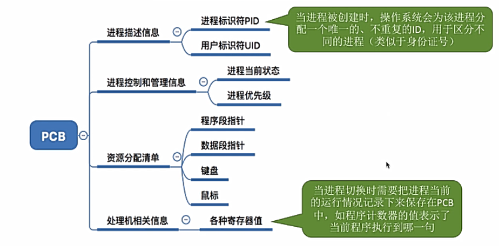
### 2.进程的组成
进程（进程实体）由程序段，数据段和PCB组成

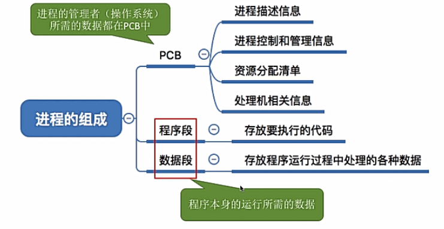

+ 程序段：存放程序代码（指令序列）
+ 数据段：程序运行时使用，存放产生的运算数据比如，全局变量，局部变量，宏定义的常量
+ PCB：PCB中包含操作系统对其进行管理所需的各种信息

### 3.进程的组织
在一个系统中，通常有数十数百乃至数千个PVB，系统需要对它们进行有效的管理和组织

进程的组成讨论的是一个进程内部由那些部分构成，而进程的组织讨论的是多个进程之间的组织方式

进程的组织方式有两种

+ 链接方式
    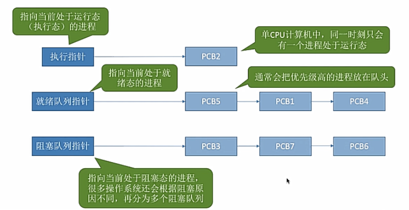
+ 索引方式
    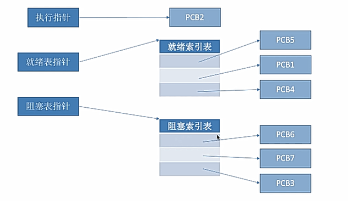

### 4.进程特征
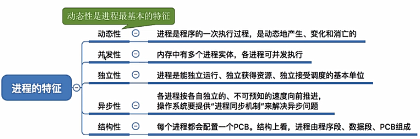

## 进程的状态与转换

### 1.进程的状态
一个进程有**五种状态**：新建，就绪，运行，等待，终止
+ 新建（new）：创建进程，操作系统为其分配所需内存等系统资源，创建和初始化PCB
+ 就绪（ready）
+ 运行（running）
+ 等待/阻塞（wait/block）
+ 终止（terminated）：进程运行结束/由于bug终止/人为撤销，操作系统需要完成撤销进程的相关工作，完成将分配给进程的资源挥手，撤销PCB等工作

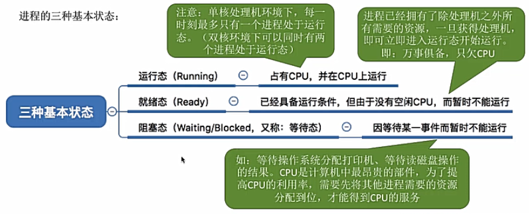

### 2. 进程状态的转换

## 进程控制
### 1.进程控制的定义
进程控制就是对系统中所有进程实施**有效的管理**，**实现进程的状态转换**

如何实现进程控制？

+ 在进程的组织中，操作系统有两种方式对进程进行组织管理（链接和索引）
+ 根据进程的状态不同，划分为多个进程队列/索引表
+ 进程的状态发生改变，进程对应的PCB中的数据也要发生改变，PCB中的数据发生了改变，则进程所在的队列产生了改变
+ 利用**原语**对实现进程控制

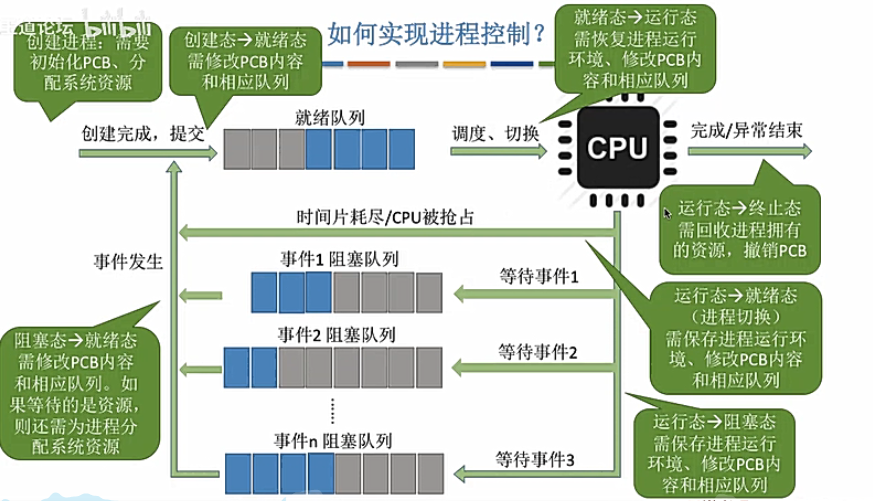

### 2.原语
原语是操作系统内核中的一种特殊程序

操作系统通过使用原语来实现进程控制，原语的特点是执行期间不允许中断，只能一气呵成（原子操作）

原语采用**关中断**和**开中断**指令来实现

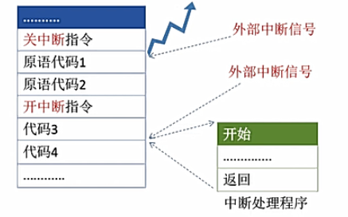

执行了关中断指令后，有外部中断信号进入，这个中断将会被忽略而不会处理

当PCB放入新的队列，同时也要保证PCB中的状态相关的数据被修改，不能出现状态不一致的情况

显然，关/开中断指令的权限非常大，必然是只能允许在**核心态**下执行的特权指令

### 3.进程控制相关的原语
原语需要做的事情无非包括三点：
1. 更新PCB中的信息，例如修改状态标志，剥夺当前进程CPU时保存运行环境，某进程开始运行前恢复运行环境
1. 将PCB插入合适的队列
1. 分配/回收资源

+ 创建原语
    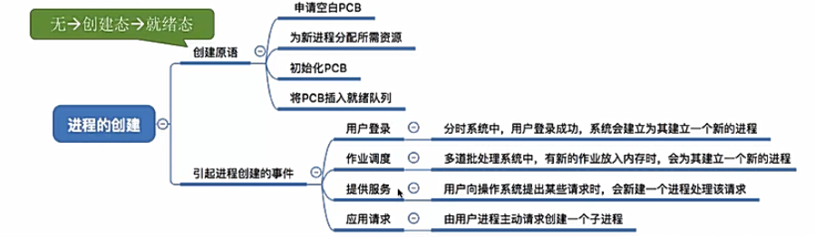
+ 终止原语
    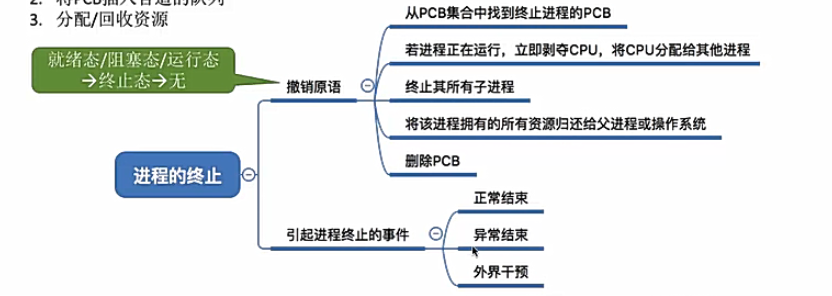
+ 阻塞和唤醒原语
    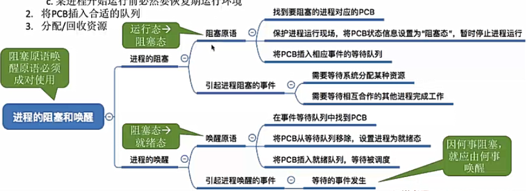
+ 切换原语
    
    
## 进程间通信

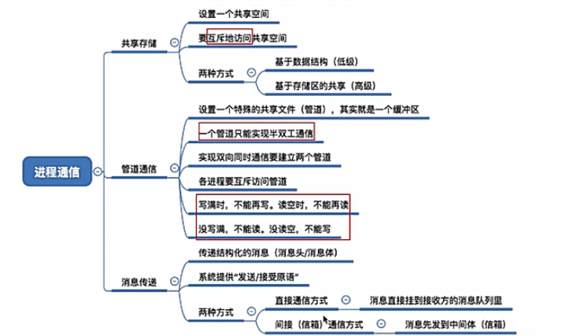

### 1.进程通信
顾名思义，进程通信就是指进程之间的信息交换/共享数据

操作系统会为每个进程分配独立的资源，因此各进程拥有的内存地址空间相互独立

为了安全，一个进程不能直接访问另一个进程的地址空间，所以操作系统提供了三种进程通信方法
+ 共享存储
+ 消息传递
+ 管道通信

### 2.共享存储
操作系统为进程间提供一个**共享空间**，但是需要注意的是两个进程对共享空间的访问必须是**互斥**的

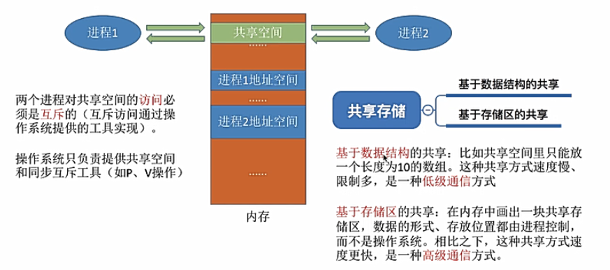

### 3.管道通信
所谓管道，就是一个固定大小的缓冲区

管道只能实现**半双工通信**

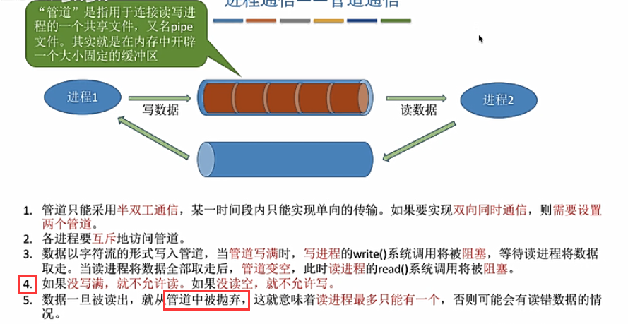

### 4.消息传递
进程间的数据交换以格式化的**消息**message为单位

os中的消息和计网中的报文类似，是一种格式化的消息

每个进程都有**接收消息的缓冲队列**

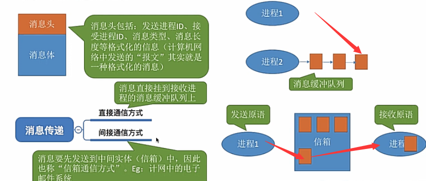