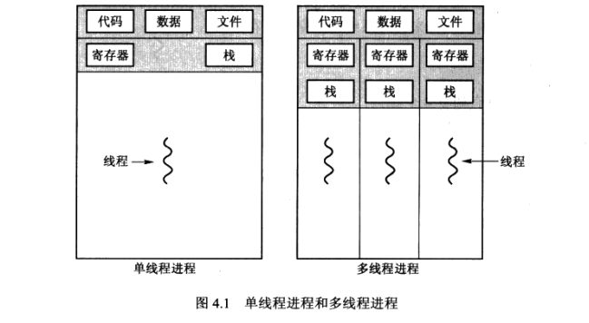
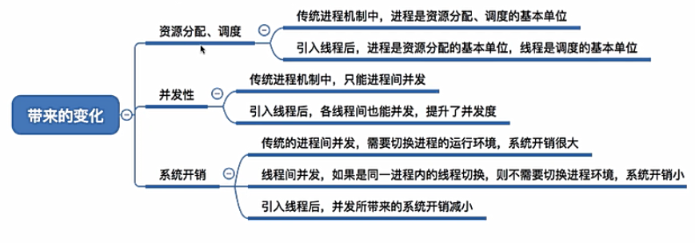
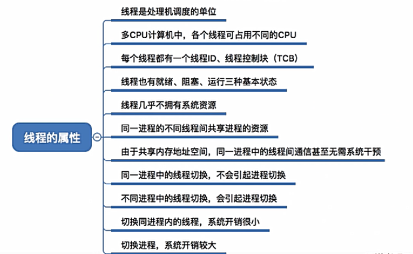
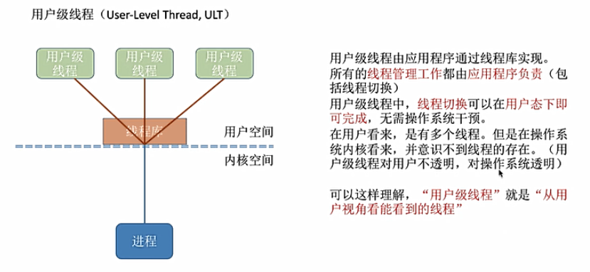
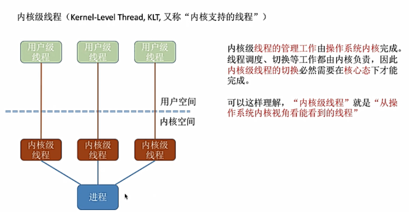
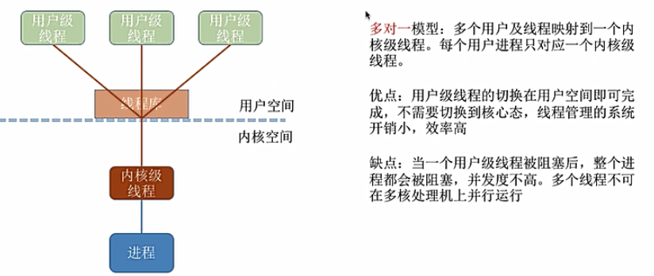
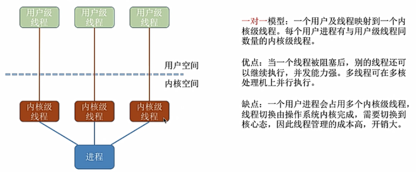
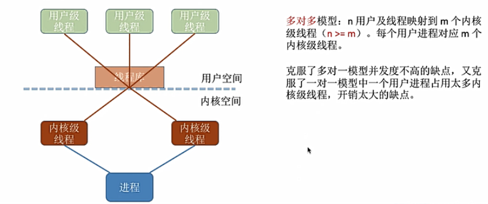
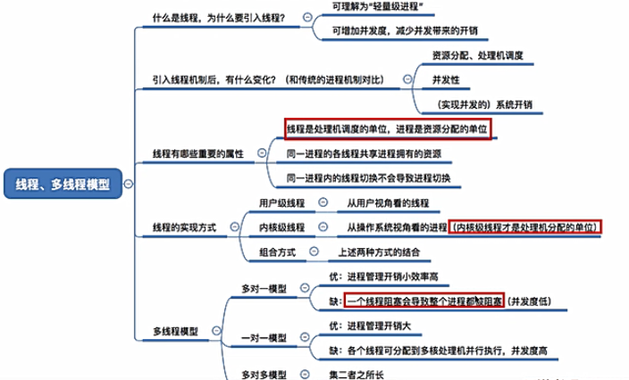

# 线程
## 1.线程的引入
#### 1.线程
在引入了多进程之后，进程之间可以并发执行

但是有的进程可能需要“宏观上同时”做很多事情，比如使用qq时需要一边聊天一边发消息

而传统的进程只能串行执行一系列程序

为此，引入了**线程**，**线程之间也可以并发执行**，来增加并发度

#### 2.线程与进程的区别
传统的进程可以看成只有一个线程，也称**重型进程**

线程可以看作是**轻型进程**

一个线程与他的对等线程共享**代码段**，**数据段**，**操作系统资源**

每个线程都有自己的程序计数器，寄存器，栈空间和TID

现在的操作系统支持多线程，许多应用程序软件也是多线程服务

#### 3.在引入了线程之后：
+ 线程作为CPU调度的基本单位
+ 进程作为系统资源的分配单位

#### 4.引入线程也带来了更多变化:
1. 资源分配/调度
2. 并发性
3. 系统开销

## 2.线程的重要属性

注意点：线程几乎不拥有系统资源，系统资源的分配是分配给进程的，同一进程内的不同线程共享进程的资源

## 3.线程的实现方式
+ 用户级线程
+ 内核级线程

#### 1.用户级线程
关键：
1. 用户态管理，无需操作系统干预
2. 内核不知道用户线程的存在
3. 通过线程库实现

#### 2.内核级线程
关键：
1. 由操作系统内核进行内核级线程管理
2. 内核级线程才是CPU调度的最小单位

## 4.多线程模型
在同时支持用户级和内核级线程的系统中，几个用户线程映射到几个内核级线程的问题引出了**多线程模型**问题
+ 多对一
    
    
    内核级线程处理用户级线程，当某一用户级线程阻塞，那么该内核级线程也会被阻塞
+ 一对一
    
+ 多对多
    
    
## 5.总结
