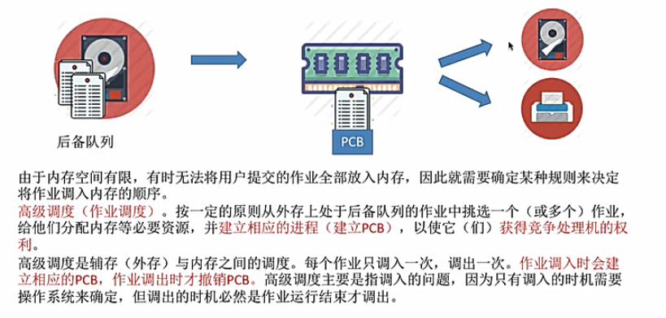
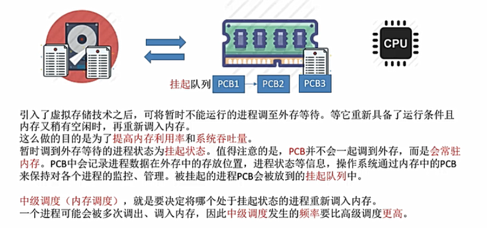
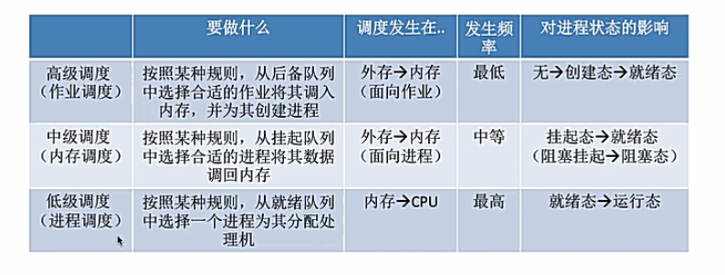
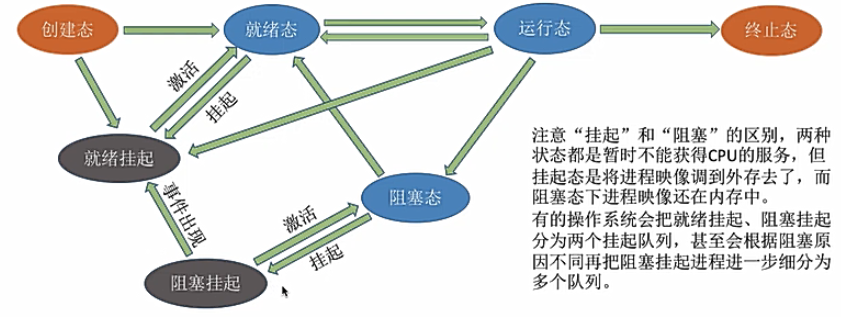
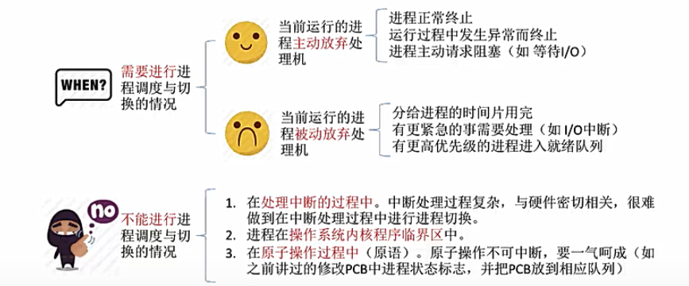
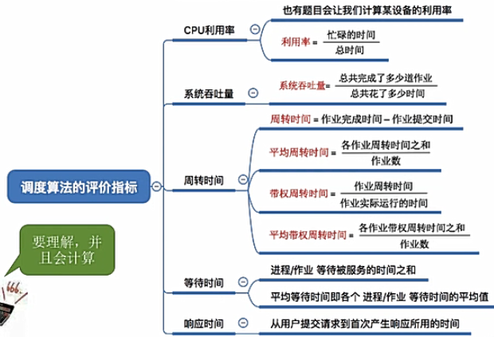
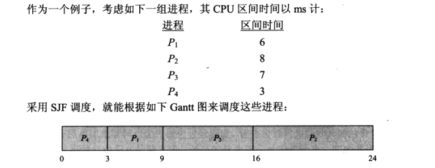
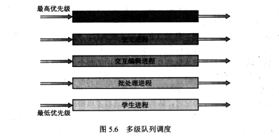
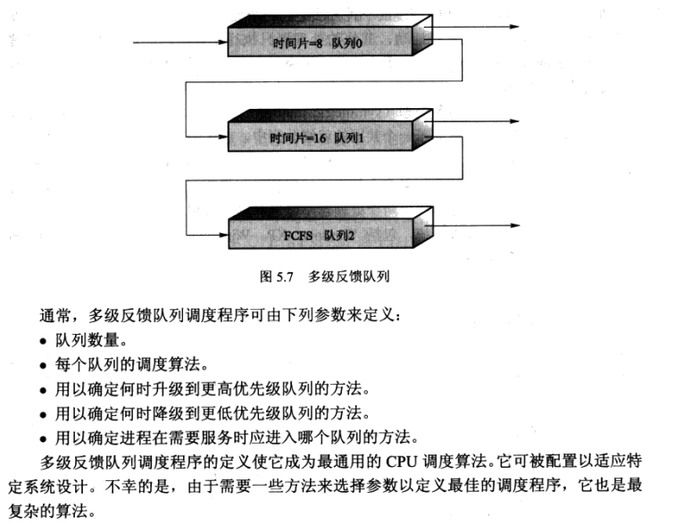

# CPU调度
## 调度的基本概念
### 1.调度
调度的研究问题：当有一堆任务要处理，但由于资源有限，这些任务无法同时处理，这就需要确定按某种规则来决定处理这些任务的顺序

在多道程序系统中，进程的数量(任务数量)往往是多于处理机（资源）的数量的，所以需要进行CPU调度

某种调度规则就是按照一个算法来进行调度

CPU调度/进程调度：按照**某种算法**选择一个进程将**处理机**分配给它

### 2.调度的三个层次
1. 高级调度/作业调度/长程调度：外存调入内存并初始化PCB

    决定了多道程序处理的**道**，长程调度需要融合IO型进程和CPU型进程，让IO设备和CPU的利用率都理想
    
2. 中级调度/内存调度/中程调度：为缓和内存紧张问题，减轻系统负载，提高系统利用率，将外存的进程映像调回内存，注意进程的PCB始终保存在内存中
    
3. 低级调度/进程调度/短程调度：就绪队列选取进程分配CPU
    

三种调度的对比

补充：进程的挂起状态（suspend），挂起状态又可分为两种
+ 就绪挂起
+ 阻塞挂起

## 进程调度的时机与方式
### 1. 进程调度与切换的时机
进程调度：也称低级调度，就是按照某种算法从就绪队列中选择一个进程为其分配处理机

需要进程进程调度与切换的情况：
+ 当前获得cpu的进程**主动放弃**处理机
+ 当前获得cpu的进程**被动放弃**处理机

注意：进程在**操作系统内核程序临界区**中不能进行处理机调度与切换，而进程处于普通资源临界区时是**应该进行处理机调度**的

比如IO设备的临界区，如果不能进行处理机调度，则进程一直霸占着cpu，导致cpu一直空闲着，导致cpu利用率降低

### 2.进程调度的方式
+ **非抢占式**：**只允许进程主动放弃处理机**，在运行过程中即便有更紧急的任务到达，当前进程依旧使用处理机，直到该进程终止或主动要求进入阻塞
+ **抢占式**：当有一个更重要的进程需要处理机/时间片到，则**立即暂停正在执行的进程，剥夺该进程分配的cpu**，进行进程调度

非抢占式实现简单，系统开销小但是无法及时处理紧急任务

而抢占式可以处理更紧急的进程，也可以使得进程按照时间片轮流执行（通过时间中断）

**抢占式的进程调度适合用于实时操作系统**

### 3.进程的切换与过程
+ 狭义的进程调度：从就绪队列中**选择**一个要运行的进程
+ 进程切换：前一个进程**让出处理机**，另一个进程**占用处理机**
+ 广义的进程调度：包含选择一个进程和进程切换两个步骤

## 调度算法的评价指标

+ CPU利用率

    CPU“忙碌”的时间占总时间的比例，利用率 = 忙碌时间 / 总时间

    **在多道程序并发执行的情况，使用甘特图来辅助计算**

+ 系统吞吐量

    单位时间内完成作业的数量，吞吐量 = 总共完成了多少道作业 / 总共花费了多少时间

+ 周转时间
    
    周转时间是指从作业**被提交**给系统开始到**作业完成为止**的这段时间间隔
    
    周转时间：高级调出的时间 + 低级调度的时间 + 进程在cpu上执行的时间 + 进程等待IO分配与操作完成的时间
    
    + **周转时间** = 作业完成时间 - 作业提交给系统的时间
    
    + **平均周转时间** = 各作业周转时间之和 / 作业数

    + **带权周转时间** = 作业周转时间 / 作业实际运行的时间   --->  带权周转时间与周转时间都是越小越好，用户体验更好

+ 等待时间

    进程处于**等待处理机**状态时间之和，等待时间越长，用户满意度越低
    
    作业的等待时间还需要计算作业在外存后备队列进入内存等待的时间
    
+ 响应时间
    
    用户**提交请求**到**首次产生响应**所用的时间

## 调度算法
#### 1. 先到先服务（first-come-first-service）
最简单的CPU调度算法是**先到先服务调度算法**

当一个进程进入到就绪队列，其PCB就会被链接到FCFS队列的**尾部**

先到先服务fcfs算法的缺点：
1. 性能较差，比如等待时间较长/响应时间较长等
2. 护航效果（convoy effect）：所有其他进程（IO约束进程）都等待一个大进程（CPU约束进程）完成释放CPU

#### 2.最短作业优先（shortest-job-first SJF）
最短作业优先调度算法会在CPU为空闲时，选择具有**最短的下一个CPU区间**的进程来分配CPU

SJF调度算法可证明为最佳的，SJF的平均等待时间最小

SJF算法的真正困难是如何知道下一个CPU区间的长度，难以在CPU调度层次上加以实现，而经常用于长期调度

SJF算法可能是**抢占的**或**非抢占的**：抢占式SJF又称最短剩余时间优先调度，当一个新进程达到队列而以前进程正在执行时就需要进行判断选择，**若新进程的CPU区间比正在执行的进程的剩余CPU区间短**，则抢占正在执行的进程的CPU资源

SJF算法可能产生饥饿：在SJF中，一些下一个CPU区间大的进程可能永远得不到CPU而永远不能运行

#### 3.优先级调度（priority scheduling algorithm）
SJF算法可以作为通用**优先级调度算法**的一个特例

优先级调度中每一个进程都有一个优先级与其关联，具有最高优先级的进程会被分配到CPU

优先调度算法会产生饥饿，也称无穷阻塞（indefinite blocking）

解决饥饿的方案——老化（aging）：逐渐增加系统中等待很长/优先级低的进程的优先级

#### 4.轮转法调度（round-robin，RR）
轮转法调度算法是专门为**分时系统**设计的，类似于FCFS调度，但是**增加了抢占以切换进程**

RR定义了一个较小时间单元片（time slice），为每个进程分配不超过一个时间片的CPU（RR算法是可抢占的）

RR算法的性能与时间片的大小有关
+ 如果时间片过大，则与FCFS一样有很长的等待时间
+ 若时间片过短，则称为处理器共享，会增加上下文切换开销

#### 5.多级队列调度算法（multilevel queue scheduling algorithm）
在进程可容易地划分成**不同组**的情况下，可以将就绪队列划分成多个独立队列，根据进程的属性不同，一个进程将被永久分配进入一个队列，而每个队列都有自己的调度算法

队列之间的调度
+ 每个队列与更低层队列相比应该有**绝对的优先级差异**
+ 队列之间划分时间片，每个队列都有一定的CPU时间，这些时间就可以用于调度队列内进程

举例：前台（交互）进程 和 后台（批处理）进程的划分
+ 两种进程具有不同的响应时间要求，因此有不同的调度需求
+ 前台进程应具有更高的优先级

#### 6.多级反馈队列调度（multilevel feedback queue scheduling algorithm）
在多级队列调度不够灵活（一个进程被永久分配到一个队列中）基础上，多级反馈队列调度算法允许**进程在队列之间移动**

