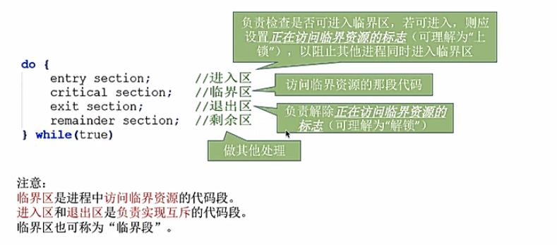
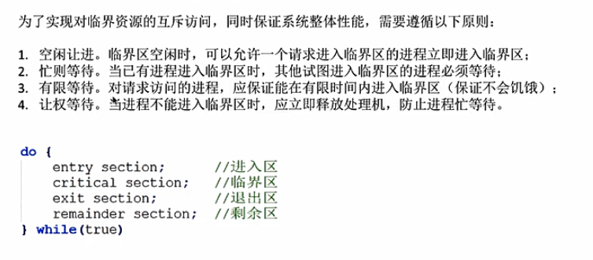
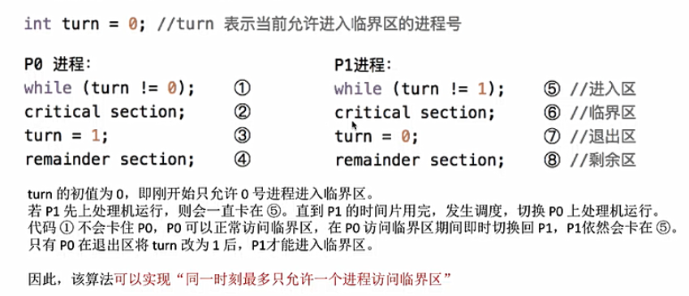
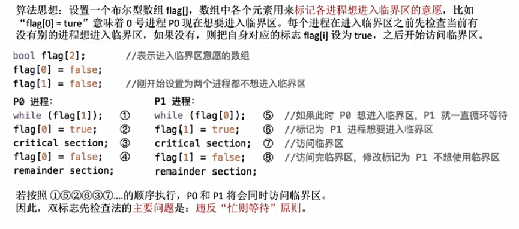
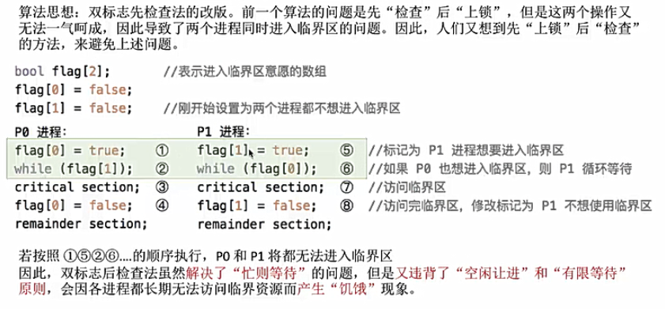
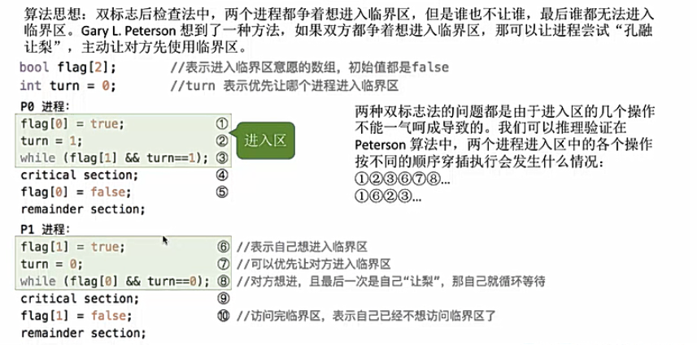
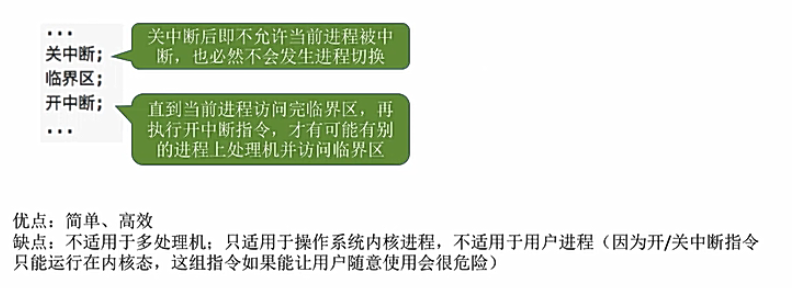
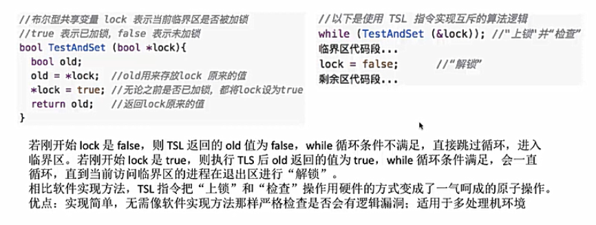
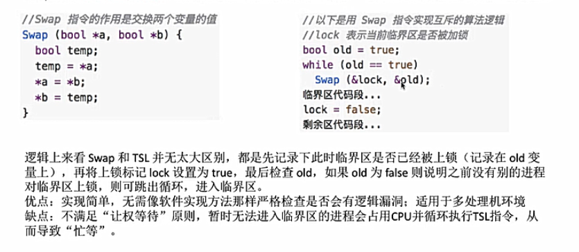

# 进程同步与互斥
知识点回顾：进程具有异步性的特征，各个并发执行的进程以各自独立的，不可预知的速度向前推进

但是我们有时需要进程以我们**期待的次序**来推进

+ **进程同步**：亦称直接制约关系，两个或多个进程需要在确定的工作次序（制约关系）下执行

+ **进程互斥**：进程的“并发”需要“共享”的支持，各个并发执行的进程不可避免地需要**共享一些系统资源**（如内存，IO设备等）

    资源共享方式分为**互斥共享方式**和**同时共享方式**两种

    我们把第一种（互斥共享访问）的资源称为**临界资源**，例如摄像头/打印机等
    
    对临界资源的访问，必须是**互斥**地进行，也就是间接制约关系。当一个进程访问某临界资源时，另一个想要访问该临界资源的进程**必须等待**
    
    实现对临界资源的互斥访问，在逻辑上分为如下四个部分
    
    
    

### 进程互斥的软件实现方式
#### 1.单标志法
两个进程在访问完临界区后会把使用临界区的权限转交给另一个进程，也就是每个进程**进入临界区的权限只能被另一个进程赋予**

如果p0一直不进入临界区，则p1一直无法进入临界区，违背了空闲让进

#### 2.双标志先检查法
设置一个flag数组，数组中各元素用来标记各进程想进入临界区的意愿

违背忙则等待原则的原因在于 进行检查 和 上锁 这两个步骤，不是原子性的，如果两个操作是一气呵成的则这个算法是正确的

#### 3.双标志后检查法
是双标志检查法的改版，前一个算法是先检查后上锁，这个算法是**先上锁后检查**

但是同样存在问题：p0和p1两个进程可能都将无法进入临界区

**并发执行的异步性是导致上述三种方法都违背互斥访问的原则**

#### 4.Peterson算法
主动争取-主动谦让-检查对方是否想进并且己方是否谦让

peterson算法用软件方法解决了进程互斥问题，遵循**空闲让进，忙则等待，有限等待**，但是未遵循**让权等待**

### 进程互斥的硬件实现方式
#### 1.中断屏蔽方法
利用**开中断和关中断**指令实现（与原语的实现思想相同）

某进程开始访问临界区到结束访问为止都不允许被中断，也就不能发生进程切换

#### 2.TestAndSet指令
简称TS/TSL指令

TSL指令是用硬件实现的，执行过程不允许被中断，只能一气呵成

但是TS指令方法不遵守让权等待

#### 3.Swap or Exchange 指令
Swap指令是用硬件实现的，执行的过程不允许被中断，只能一气呵成

