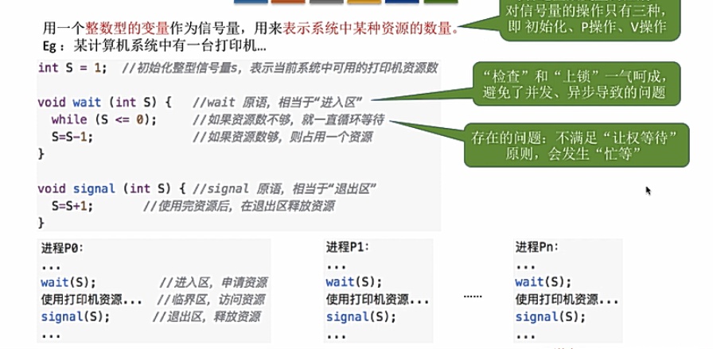
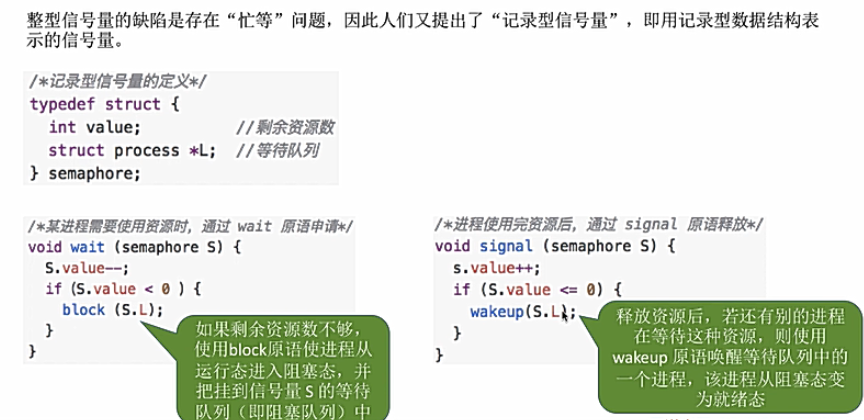
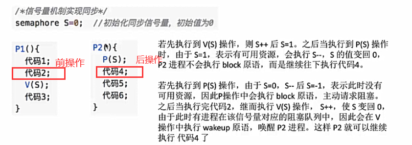
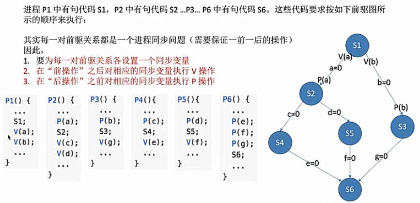

# 进程同步与互斥
知识点回顾：进程具有异步性的特征，各个并发执行的进程以各自独立的，不可预知的速度向前推进

但是我们有时需要进程以我们**期待的次序**来推进

+ **进程同步**：亦称直接制约关系，两个或多个进程需要在确定的工作次序（制约关系）下执行

+ **进程互斥**：进程的“并发”需要“共享”的支持，各个并发执行的进程不可避免地需要**共享一些系统资源**（如内存，IO设备等）

    资源共享方式分为**互斥共享方式**和**同时共享方式**两种

    我们把第一种（互斥共享访问）的资源称为**临界资源**，例如摄像头/打印机等
    
    对临界资源的访问，必须是**互斥**地进行，也就是间接制约关系。当一个进程访问某临界资源时，另一个想要访问该临界资源的进程**必须等待**
    
    实现对临界资源的互斥访问，在逻辑上分为如下四个部分
    
    
    

### 进程互斥的软件实现方式
#### 1.单标志法
两个进程在访问完临界区后会把使用临界区的权限转交给另一个进程，也就是每个进程**进入临界区的权限只能被另一个进程赋予**

如果p0一直不进入临界区，则p1一直无法进入临界区，违背了空闲让进

#### 2.双标志先检查法
设置一个flag数组，数组中各元素用来标记各进程想进入临界区的意愿

违背忙则等待原则的原因在于 进行检查 和 上锁 这两个步骤，不是原子性的，如果两个操作是一气呵成的则这个算法是正确的

#### 3.双标志后检查法
是双标志检查法的改版，前一个算法是先检查后上锁，这个算法是**先上锁后检查**

但是同样存在问题：p0和p1两个进程可能都将无法进入临界区

**并发执行的异步性是导致上述三种方法都违背互斥访问的原则**

#### 4.Peterson算法
主动争取-主动谦让-检查对方是否想进并且己方是否谦让

peterson算法用软件方法解决了进程互斥问题，遵循**空闲让进，忙则等待，有限等待**，但是未遵循**让权等待**

### 进程互斥的硬件实现方式
#### 1.中断屏蔽方法
利用**开中断和关中断**指令实现（与原语的实现思想相同）

某进程开始访问临界区到结束访问为止都不允许被中断，也就不能发生进程切换

#### 2.TestAndSet指令
简称TS/TSL指令

TSL指令是用硬件实现的，执行过程不允许被中断，只能一气呵成

但是TS指令方法不遵守让权等待

#### 3.Swap or Exchange 指令
Swap指令是用硬件实现的，执行的过程不允许被中断，只能一气呵成

### 信号量机制
信号量就是一个变量，可以用一个信号量来表示**系统中某种资源的数量**

用户进程可以通过使用操作系统提供的一对原语来对信号量进行操作，从而实现进程互斥和进程同步

原语是由关中断和开中断指令实现的，其执行只能一气呵成，不可被中断

一对原语： **wait原语**和**signal原语**，简称为PV操作，用于操作信号量

+ wait(S) = P(S)  实现系统资源的申请
+ signal(S) = V(S)  实现系统资源的释放

#### 1.整型信号量
用一个整数型的变量作为信号量，用来表示系统中某种资源的数量

存在忙等问题

#### 2.记录型信号量
维持一个**等待队列**，记录要使用资源的进程，解决了忙等问题

当资源不够时，阻塞进程并放入等待队列(block原语)，当资源空闲时，唤醒等待队列中的一个进程(wakeup原语)

+ value为**负数**时，其**绝对值**为在等待队列中等待系统资源的进程数量
+ S.value=0，资源**恰好分配完**
+ S.value+1<=0说明有进程在等待该资源，若>0则表示没有进程在等待该资源了

遵循让权等待原则，因为当某一进程资源请求不能被满足，则会主动释放CPU进入就绪队列（阻塞态）

#### 3.信号量机制实现进程互斥
1. 分析并发进程的关键活动，划定临界区
2. 设置互斥信号量mutex，初始值为1，把临界区看作一个特殊的互斥资源
3. 在临界区之前执行P(mutex)
4. 在临界区之后执行V(mutex)

注意:
+ PV操作必须成对出现
+ 对于不同的临界资源需要设定不同的互斥信号量

#### 4.信号量机制实现进程同步
进程同步：要让各并发进程按要求**有序地推进**，原本异步执行的进程，按照顺序配合执行

1. 分析什么地方需要实现进程同步
2. 设置同步信号量S，初始值为0
3. 在前操作之后执行V(S)
4. 在后操作之前执行P(S) 

#### 5.信号量机制实现前驱关系
实际就是**拓扑排序**，本质为复杂的进程同步问题

