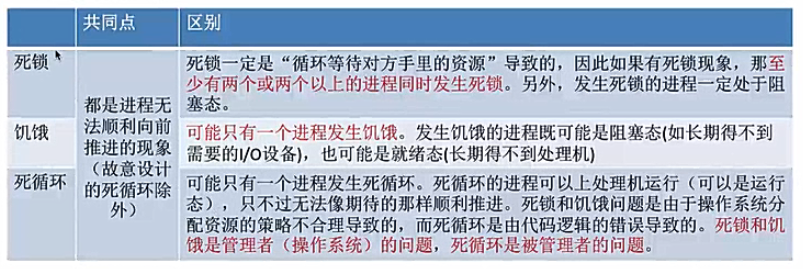
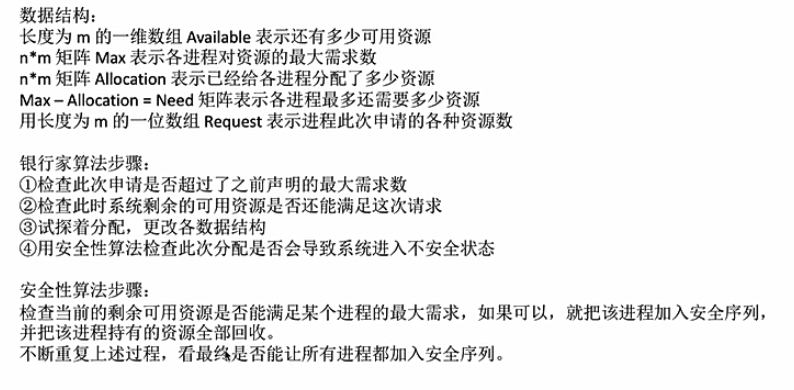
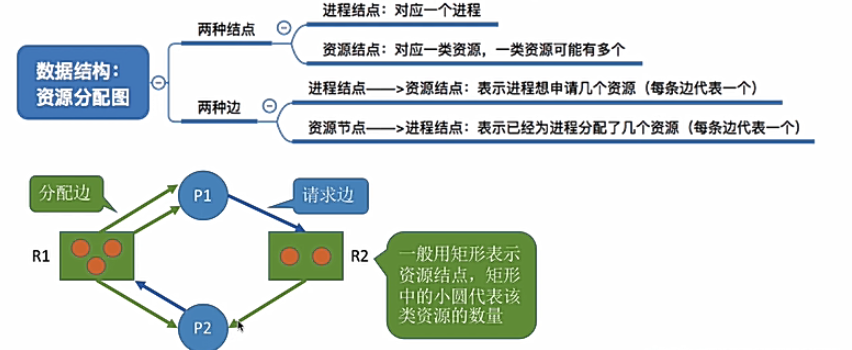

# 死锁
## 死锁的概念
#### 1.什么是死锁
在并发环境下，各进程因竞争资源而造成的一种**互相等待对方手里的资源，导致各进程都阻塞，都无法向前推进的现象**

死锁/饥饿/死循环
+ 死锁：上述
+ 饥饿：进程长期得不到想要的资源，某进程无法向前推进的现象
+ 死循环：某进程执行过程种一直跳不出某个循环的现象，可能由于bug或程序员故意设计(PV等待)

这三种情况都是由于程序无法顺利向前推进的现象

#### 2.死锁产生的必要条件
+ 互斥条件：对必须互斥访问/使用的资源的争抢才会导致死锁，比如打印设备，但是可以同时让多个进程使用的资源不会导致死锁（如内存）
+ 不剥夺条件/非抢占：不能由其他进程强行夺走资源，只能主动释放
+ 请求和保持条件：进程保持至少一个资源，并且提出新的资源请求，而该资源又被其他进程占有
+ 循环等待条件：存在一种进程资源的循环等待链，链中的每一个进程已获得的资源同时被下一个进程所请求

#### 3.产生死锁的原因
1. 对不可剥夺资源的竞争可能导致死锁
2. 进程推进顺序不当可能导致
3. 信号量的使用不当可能导致

#### 4.死锁的处理策略
+ 预防死锁：破坏死锁产生的四个必要条件种的一个或多个
+ 避免死锁：用某种方法防止系统进入不安全状态，从而避免死锁（银行家算法）
+ 死锁的检测和解除：允许死锁发生，os会检测出死锁并采取某种办法解除死锁

## 预防死锁
关键：破坏产生死锁四个必要条件种的一个或多个

+ 破坏互斥条件

    操作系统可以使用**SPOOLing技术**把独占设备在**逻辑上改造成共享设备**
    
    由**输出进程**接收进程的请求，由于进程的请求立即被接受处理，不需要再阻塞等待，进程可以继续往下运行
    
    缺点：为了系统安全，很多地方必须保护互斥性，不是所有资源都可以改造成可共享使用的资源
    
    因此很多时候无法破坏互斥条件
    
+ 破坏不剥夺条件

    当某个进程请求新的资源得不到满足时，他必须立即释放他保持的所有资源
    
    当某个进程需要的资源被其他进程所占有时，可由操作系统协助将想要的资源进行强行剥夺（例如优先级）
    
    实现较为复杂，并且释放已获得资源可能造成某进程前一阶段工作的失效，也可能造成饥饿
    
    该方法一般只适用于易保存和恢复状态的资源，例如CPU
    
+ 破坏请求和保持条件

    静态分配：进程再运行前一次申请完他所需要的全部资源（进行资源打包），如果他的资源为满足则不执行

    该方法导致资源利用率低，也可能导致进程饥饿
    
+ 破坏循环等待条件

    可采用**顺序资源分配法**，首先给系统中资源中的资源编号，规定每个进程必须按照编号递增的顺序请求资源
    
    那么已持有大编号资源的进程不可能逆向回来申请小编号的资源，从而不会产生循环等待

    1.灵活性低，2.容易导致资源浪费
    
## 避免死锁
#### 1.安全序列
所谓安全序列，如果系统按照这种序列分配资源，则每个进程都能顺利完成

只要能找出一个安全序列，系统就是安全状态，当然，**安全序列可能有多个**

但是如果分配了资源之后，系统中找不出任何一个安全序列，系统就进入了**不安全状态**，意味着可能所有进程都无法顺利执行下去了

+ 如果系统处于安全状态，一定不会发生死锁
+ 如果进入不安全状态，就**可能**发生死锁，但是死锁时一定是处于不安全状态

#### 2.银行家算法
在**资源分配之前**预先判断这次分配是否会导致系统进入**不安全状态**，以此决定是否答应资源请求

如果会进入不安全状态，就暂时不答应这次请求，让该进程先阻塞等待

+ 最大需求  已分配  最多还需要

+ 资源总数  剩余可用资源

安全性检测：依次检查剩余可用资源是否能满足**各进程**的最多还需要需求，若能满足则加入安全序列（安全序列不唯一），重复该步骤

## 死锁的检测和解除
#### 1.死锁的检测
用某种数据结构来保存资源的请求和分配信息

提供一种算法，利用上述信息来检查系统是否进入死锁状态

若资源分配图中能够找到安全序列/能消除所有边，就称这个图是**可完全简化**的，也就一定没有发生死锁

如果最终不能消除所有边/不可完全简化，那么此时就是发生了死锁

#### 2.死锁的解除
+ 资源剥夺法：挂起某些死锁进程（构成死锁状态的进程），将该死锁进程的资源抢占并资源分配给其他的死锁进程，必须防止**饿死**
+ 撤销进程法（终止进程法）：强制**撤销部分甚至全部死锁进程**，可能付出的代价很大
+ 进程回退法： 让一个或多个死锁进程回退到足以避免死锁的地步，要求系统记录进程的历史信息，设置还原点

决定对谁动手？
1. 进程优先级
2. 已执行时长
3. 还要多久完成
4. 进程已经使用了多少资源
5. 进程是交互式的还是批处理式的