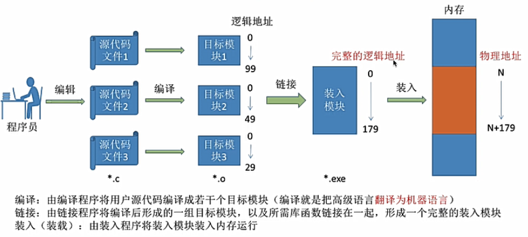
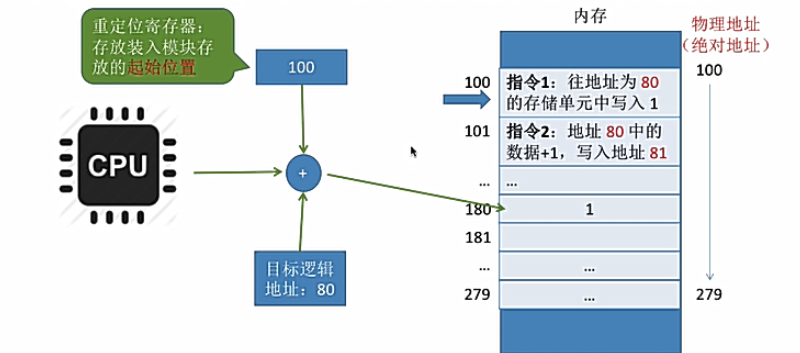
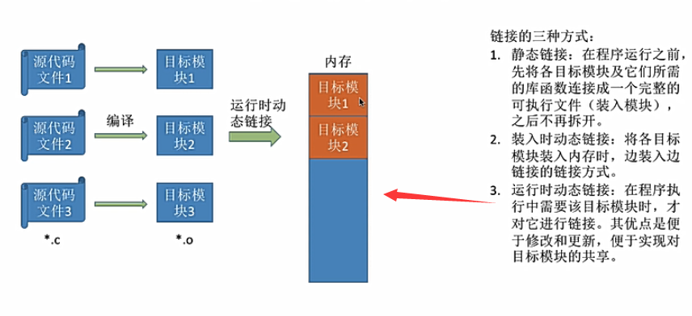

# 内存管理
## 1.什么是内存
内存是用于存放数据的硬件，其存储速度要快于外存。程序在执行前需要先放到内存中才能被CPU处理

内存中有一个一个的小房间，每个小房间就是一个**存储单元**，一个存储空间单位，并且会给存储单元绑定一个**存储地址**

如果计算机按字节编址，则每个存储单元大小为1字节；如果计算机按字编码，则每个存储单元为1个字（字长由计算机不同而不同）

我们用高级语言写的代码会编译成机器指令，这些指令会告诉CPU应该去内存的哪些地方存/取数据，这个数据应该做什么样的处理

但是编译出来的机器指令不知道数据到底放在内存的什么地方，所以编译生成的是**逻辑地址**，或叫做**相对地址**

如果知道了**相对地址**和**起始地址**，就能知道**绝对位置**，或叫做物理地址

+ 编译->翻译为机器语言
+ 链接->形成逻辑地址
+ 装入->形成物理地址

## 2.逻辑地址到物理地址的转换
在装入过程，需要进行**逻辑地址到物理地址的映射变化**，否则会出现内存禁止访问或错位的异常情况
1. 绝对装入
    
    在**编译时**就知道程序将放到内存中的哪个起始位置，则编译程序直接产生绝对地址
    
    只适用于单道环境程序
2. 静态重定位

    可重定位装入，即在装入时由**装入程序**对地址进行“重定位”，根据起始地址，将逻辑地址变换为物理地址
    
    缺点：作业一旦进入内存后，必须分配其要求的**全部内存空间**，在运行期间就不能再移动也不能再申请内存空间（在装入时就已经固定确定好了）
3. 动态重定位

    动态运行时装入，编译链接后的装入模块的地址都是从0开始，装入程序把装入模块装入内存后，并不会立即把逻辑地址转换为物理地址，而是把**地址转换推迟到程序真正要执行时才进行**
    
    因此，装入内存后所有的地址依然是逻辑地址，这种方式需要一个**重定位寄存器**的支持，来记录起始位置
    
    
    
    采用动态重定位时允许程序在内存中发生移动，只需要将**重定位寄存器**中的值发生修改即可，所以更加灵活
    
    也可以分配不连续的存储区，亦或是按需加载动态分配内存
    
另：链接的三种方式
