# 应用层
## 1.应用层概述
+ 应用层对应用程序的通信提供服务，应用层需要规定：
    1. 应用进程交换的报文类型，请求还是响应
    2. 各种报文类型的语法，入报文中的个字段及其详细描述
    3. 字段的语义和信息
    4. 进程何时/如何发送报文，以及对报文进行响应的规则

+ 应用层的功能：
    1. 文件的传输，访问和管理
    2. 电子邮件
    3. 虚拟终端
    4. 查询服务和远程作业登录

+ 应用层的重要协议
    1. FTP
    2. SMTP, POP3
    3. HTTP
    4. DNS
    
+ 应用层常使用的网络应用模型
    1. 客户/服务器模型（C/S）
        
        进程之间**服务和被服务**的关系
        
        * 客户是请求方，必须知道服务器程序的地址
        * 服务器是服务提供方，可同时处理多个客户请求
        
        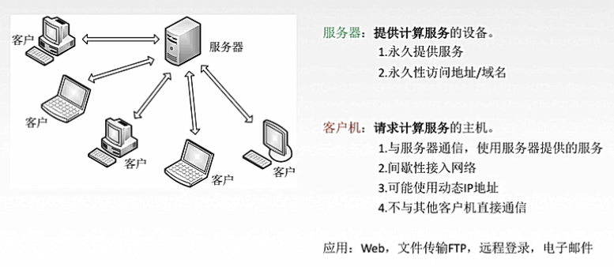
    2. 对等模型（P2P）
        
        主机在通信时**不区分请求方和服务方**
        * 既是客户又是服务器
        
        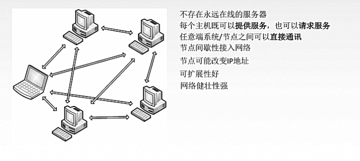

## 2.DNS
DNS，域名系统（domain name system）
+ 域名
    
    IP地址是32位/点分十进制来进行访问，不好记忆，所以引入域名的概念
    
    域名是一个**唯一的 层次树状结构**的名字
    
    每一个域名都由**标号**序列组成，各标号之间用点.隔开
    
    规定：
    1. 每一个标号不超过63个字符
    2. 不区分大小写
    3. 多个标号组成的完整域名总共不超过255个字符

    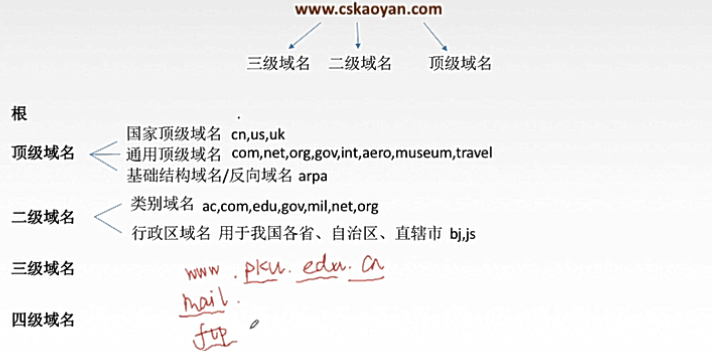
    
    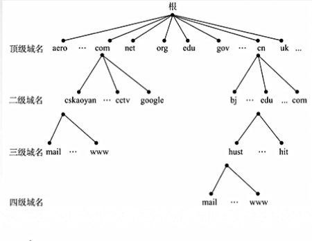

+ 域名服务器

    域名服务器层次结构
    
    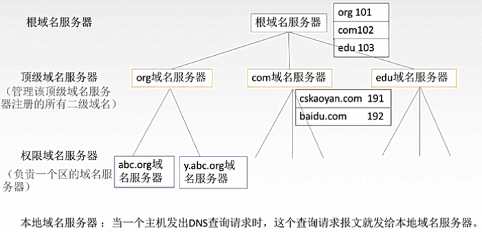
    
    注意：
    * 本地域名服务器并不属于域名服务器层次结构，但是它对域名系统非常重要，当一台主机发送DNS查询请求时，这个查询请求首先发送给本地域名服务器
    
        当本地域名服务器查询不到时，才会将查询请求发送给根域名服务器
    * 权限域名服务器是负责和管理一个区的域名服务器，管辖范围不是以域为单位，而是以**区**为单位
    
        区（zone）是域的子集
        
        域: abc.com  可划分为 abc.com 和 y.abc.com两个区
+ 域名解析过程

    **域名 ===> IP地址**
    
    * 递归查询：一种靠别人的方式
    
        查询请求将不断往下进行请求和查询
    * 迭代查询：靠自己（本地域名服务器）
        
        由本地域名服务器不断进行DNS请求
    
    域名解析用来将用户所要查询的 域名 解析为相应的IP地址
    1. 浏览器将DNS请求发给本地DNS服务器（递归查询）
    2. 本地DNS服务器查看域名 是否保存在记录（在资源记录表，一种高速缓存）中，若有则本地解析返回，否则进行下一步
    3. 本地DNS服务器向DNS根服务器发送请求
    4. 通过递归查询/迭代查询得到域名（存在）所对应的IP地址，返回给本地DNS服务器
    5. 本地DNS服务器将结果返回给浏览器并保存在自己的记录表中
    
    另： 许多主机在开机时从本地域名服务器下载部分记录放入本机的高速缓存
    
    主机和本地域名服务器都设置了高速缓存：可以减轻域名服务器的负荷，同时使查询速度加快，需要定时更新
    
    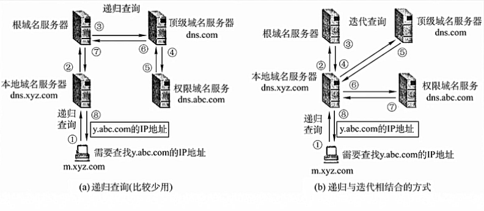
    
## 3.FTP
**FTP**，文件传输协议（file transfer protocol），基于TCP

TFTP，简单文件传送协议（trivial file transfer protocol），基于UDP
+ FTP介绍
    
    FTP提供不同种类主机系统（硬件/软件）之间的文件传输能力，可以屏蔽不同操作系统的差异
    
+ FTP服务器和用户端

    **FTP是基于客户/服务器的协议**
    + FTP客户端软件，遵循FTP协议，与FTP服务器进行文件传送
    + FTP服务器，依照FTP协议提供服务，进行文件传送
+ FTP工作原理
    + 登录：ftp地址，用户名和密码 / 匿名登录（向公众提供文件拷贝服务，即可不用进行登记注册）
    + FTP使用TCP实现可靠传输，并且FTP的客户端和服务器要建立两根并行的TCP虚连接
    + FTP服务器内部存在 **1个主进程** 和 **n个从属进程**
        + 主进程：负责接收新请求
            1. 打开熟知端口（21），使客户进程能够连接上
            2. 等待客户进程发出连接请求
            3. 启动从属进程处理客户进程发来的请求
        + 从属进程：负责处理单个请求，当请求处理完毕后即终止
            1. 控制进程，用于传请求
            2. 数据传送进程，用于传文件
    
    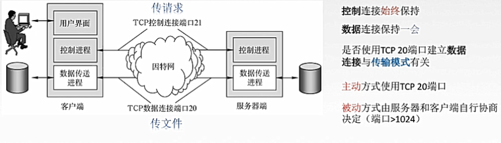
    由于FTP使用了两个不同的端口号，所以数据连接和控制连接不会发生混乱
+ FTP传输模式
    + 文本模式：ASCII模式，以文本序列传输数据
    + 二进制模式：Binary模式，以二进制序列传输数据

## 4.电子邮件
### 1.电子邮件的信息格式
+ 信封 —— 收件人电子邮件地址 eg. abc@163.com
    
    用户名 @ 邮件服务器的域名
    
    xyz   @  abc.com
    
    其中abc.com就是邮件服务器的域名，xyz是这个邮件服务器中的用户的用户名
+ 内容
    1. 首部
        + From: 111@163.com
        + To: abc@163.com
        + Subject: Hello!
        + Date: 2020-04-15
    2. 主题：写信的内容
###  2.电子邮件系统的组成结构
1. 用户代理(User Agent)：用户和电子邮件系统之间的接口 

    运行的应用程序/客户端软件，常见的用户代理是Foxmail，Outlook
    
    可以实现撰写/显示信件/处理/通信（发送给邮件服务器）
2. 邮件服务器：24小时不间断工作，并且具有很大容量的邮件信箱
    + 发送和接收邮件
    + 向发件人报告邮件传送结果（已交付/被拒绝/丢失）
    + 邮件服务器之间是C/S架构，每一个邮件服务器既可以是客户端也可以是服务器端
3. 协议
    + 用户代理=>发送方邮件服务器：SMTP
    + 发送方邮件服务器=>接收方邮件服务器：SMTP
    + 接收方邮件服务器=>收件人用户代理（读取邮件）：POP3，IMAP
    

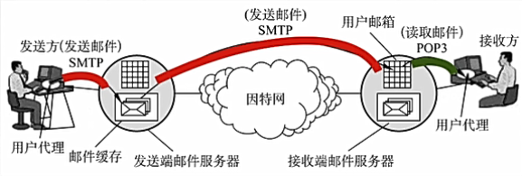
### 3.SMTP
    
1. SMTP规定两个相互通信的SMTP进程之间应如何交换信息

2. 负责发送邮件的SMTP进程就是SMTP客户，负责接收邮件的进程就是SMTP服务器

SMTP重点： **TCP连接**  **端口号25**  **C/S**

+ SMTP三阶段
    1. 连接建立
    2. 邮件传送
    3. 连接释放
    
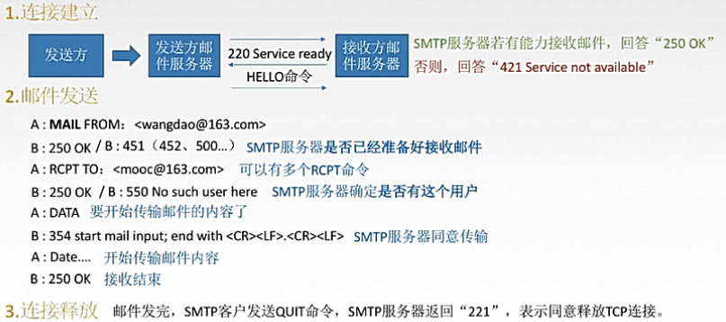

+ SMTP不可以传送可执行文件或二进制对象，SMTP仅限于传送7位ASCII码

+ **MIME**通用因特网邮件扩充

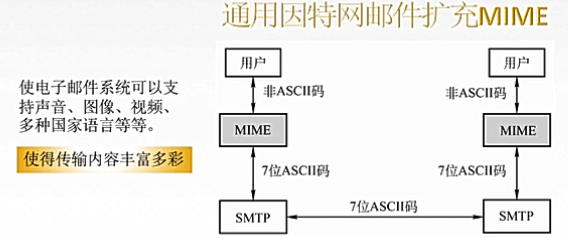

### 4.邮局协议POP3
POP3协议只存在接收端服务器将邮件读取交付给用户代理

POP3：TCP连接，端口号110，C/S方式

POP3工作方式
+ 下载并保存（在服务器）
+ 下载并删除 --- 不方便

### 5. IMAP，网际报文存取协议
IMAP协议比POP复杂，当用户pc上IMAP客户程序打开IMAP服务器的邮箱时，用户可以看到邮件的首部，若用户需要打开某个邮件，该邮件才上传到用户的计算机上

IMAP可以让用户在不同地方使用不同的计算机随时上网阅读处理邮件，还允许只读取邮件中的某一个部分

### 6.基于万维网的电子邮件（现在普遍使用的发邮件方式）
不用专门下载发邮件的软件，只需要在浏览器进行邮件传送

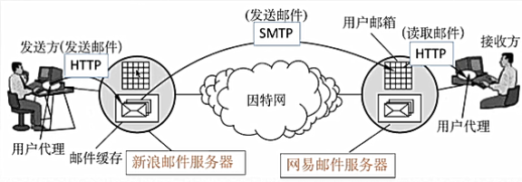

+ 邮件服务器可以是任何公司的邮件服务器
+ 与用户代理接触的两个环节都是HTTP协议

## 5.万维网和HTTP协议
### 万维网
万维网是无数个网络站点和网页的集合

+ 通过统一资源定位符**URL**来指出资源的位置以及浏览器应该怎么处理它

+ 万维网的网页使用超文本标记语言**HTML**，使得万维网页面设计者可以很方便地从一个界面的链接转到另一个界面

+ 万维网通过**HTTP**协议进行数据通信
### URL
用于在万维网指出资源的位置以及浏览器应该怎么处理它

**URL可以唯一标识一个资源（文字/视频/音频）**

url一般形式
+ <协议>://<主机>:<端口>/<路径>
+ 协议：http，ftp
+ 主机：域名，IP地址

用户通过点击超链接（锚点，通过URL指向另一个资源）/ 浏览器中输入url 来获取资源，这些资源通过超文本传输协议HTTP传送给使用者

### HTTP协议
规定用户如何发请求（上网），服务器如何响应请求（提供资源）

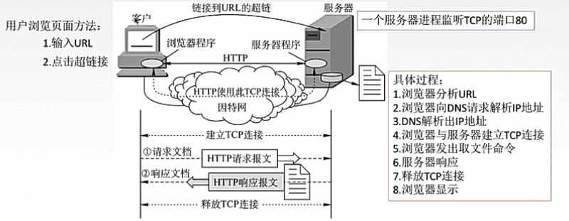

1. HTTP的特点
    + HTTP是无状态的：没有记忆的
        
        但是实际工作中，一些万维网站点常常希望能够识别用户
        
        cookie：存储在用户主机中的文本文件，记录一段时间内某用户的信息和记录，从而提供个性化服务
    + HTTP是无连接的
    
        HTTP采用TCP作为运输层协议，但HTTP协议本身是无连接的，即通信双方在交换http报文之前不需要建立http连接   
    + 媒体独立：任何类型的数据都可以通过HTTP发送 
2. HTTP的连接方式
    + 持久连接 keep-alive：客户和服务器的连接保持，可以继续进行请求和相应
        + 非流水线
        
            发送一个请求必须等到该请求得到响应后才能进行进行请求（停-等）
            
            当某一个请求出现阻塞等问题时就会导致同一条连接的后续请求被阻塞 - HOLB
        + 流水线
        
            可以同时连续发送多个请求，服务器依次进行响应
            
            客户端发起一次请求时不必等待响应便直接发起第二个请求；服务端按照请求的顺序依次返回结果
            
            并没有彻底解决HOLB(HEAD OF LINE BLOCKING，线头阻塞)，为了让同一个连接中的多个响应能够和多个请求匹配上，响应仍然是按请求的顺序串行返回的，仍然造成HOLB
        + 补充：http2.0提出multiplexing（复用）技术
            
            multiplexing技术能够让多个请求和响应的传输完全混杂在一起进行，通过streamId来互相区别，这彻底解决了holb问题，同时还允许给每个请求设置优先级，服务端会先响应优先级高的请求
            
    + 非持久连接：在完成一次请求-响应后，断开连接
    
    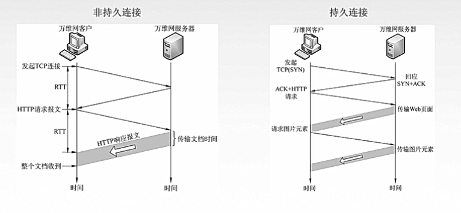
3. HTTP报文结构

## 应用层总结
特别感谢：王道考研-计算机网络

B站链接： [王道考研-计算机网络](https://www.bilibili.com/video/BV19E411D78Q?p=74)

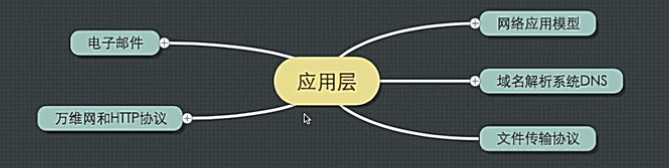