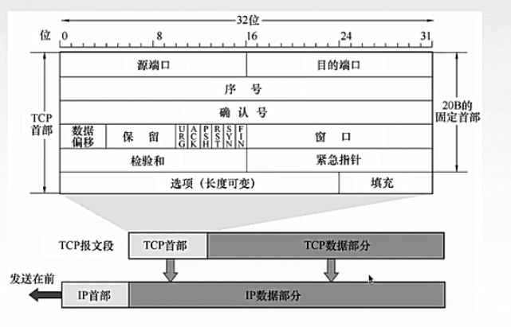
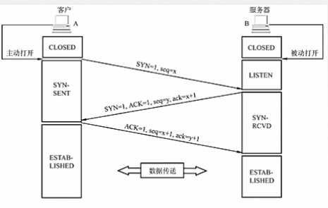
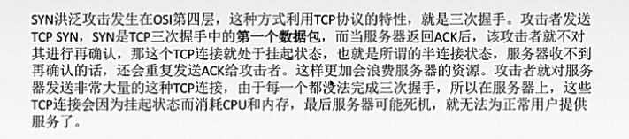
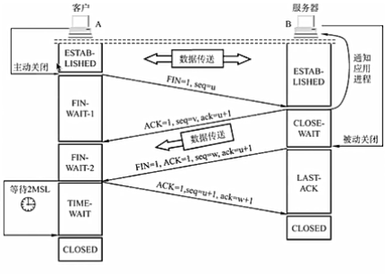
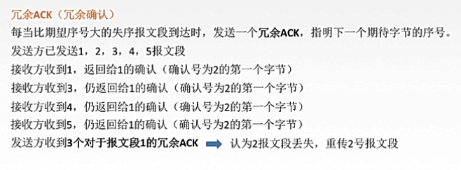
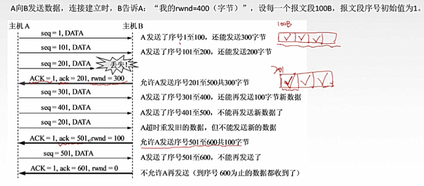
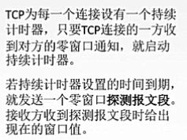
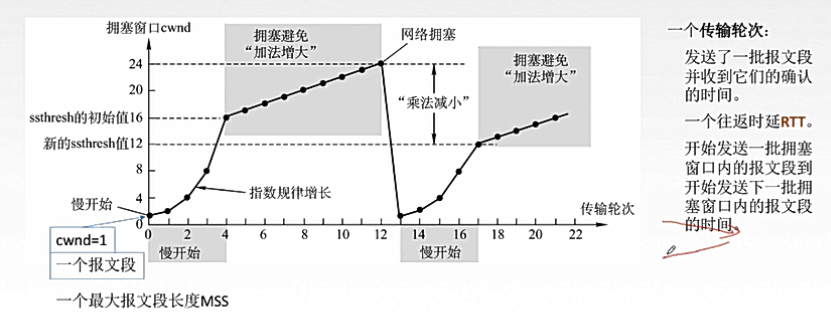
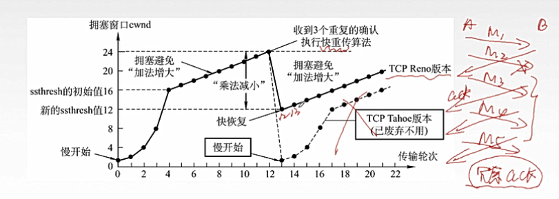

# 运输层
## 1.运输层作用
+ 通信的真正端点并不是主机而是主机中的 进程
+ 运输层为它上面的应用层 提供 端到端（end2end）的通信服务
+ 运输层的两个主要协议：UDP & TCP

## 2.端口
+ 端口(port)，即通信进程的一个标识符(pid, port ID)，16位
+ 端口的分类
    1. 服务器端使用的端口号
        1. 知名端口（well-known）：数值为 0~1023
            这些端口被指派给了TCP/IP中最重要的应用程序
            FTP(21), DNS(53), HTTP(80), HTTPS(443)
        2. 登记端口号：数值为 1024~49151
            这些端口是为没有熟知的应用程序使用的，必须进行登记注册以防重复
            mySQL(3306), SQLServer(1433)
    2. 客户端使用的端口：49152~65535
        1. 这类端口留给客户端进程选择暂时使用
        
## 3.UDP
+ UDP（user datagram protocol，用户数据报协议）
+ UDP的主要特点
    1. 面向无连接，即发送数据之前不需要建立连接。减少建立连接的开销 和 发送数据之前的时延
    2. 尽最大努力交付，即不保证可靠交付，不提供数据报传输的可靠保证
    3. 面向报文：对应用层交下来的 报文 添加首部后就交付IP层
    4. 没有拥塞控制，网络出现拥塞不会使源主机的发送速率降低，很多实时应用（实时视频会议）要求源主机以恒定的速率发送数据，并匀速在网络发生拥塞时丢失一些数据
    5. UDP支持 一对一，一对多，多对一，多对多的交互通信
    6. UDP的首部开销小，只有8个字节
+ UDP的首部（一共8个字节）
    1. 源端口：源端口号
    2. 目的端口：目的端口号
    3. 长度：UDP用户数据报的长度
    4. 校验和：检测UDP用户数据包在传输过程中是否有错，若有错则丢弃
    （在IP数据报首部中的 检验和 字段，只检查首部是否有差错而不检查数据部分）

## 4.TCP基本概念
+ TCP的特点：
    1. 面向虚连接
    2. 提供全双工通信
       1. 通信双方可以同时发送/接收消息
       2. 通信双方都设置有 发送缓存 和 接收缓存
    3. 提供可靠交付：无差错，不丢失，不重复，按序到达
    4. 点对点通信，每条tcp连接只能有两个端点
    5. 面向字节流：tcp把数据看作是 一连串无结构的字节流
    6. TCP不是使用停等协议，可以连续发送多个报文段，接收方采用累计确认机制来进行确认
+ TCP的首部 

    
    
    ### 字段解释
    1. 序号：本报文段所发送数据的第一个字节的序号
    2. 确认号：期望收到对方下一个报文段的第一个数据字节的序号
        
        若确认号为N，则证明序号N-1为止的所有数据都已正确收到
    3. 数据偏移（首部长度），数据起始处距离tcp报文段起始处有多远
    4. 6个控制位
        1. 紧急位URG，URG=1表明此报文段中有紧急数据，是高优先级的数据，应该尽快传送，不用在发送缓存中排队，配合紧急指针使用
        2. 确认位ACK，ACK=1时确认号有效，在连接建立后所有传送的报文段都必须把ACK置为1
        3. 推送位PSH，PSH=1时接收方尽快交付接收应用进程，不用在接收缓存排队，常与紧急位一同使用
        4. 复位RST，RST=1表明TCP连接中出现严重差错，必须释放连接
        5. 同步位SYN,SYN=1时表明这是一个连接请求/连接接收报文
        6. 终止位FIN，FIN=1时，表明报文段发送方数据已发完，要求释放连接
    5. 窗口：指己方的接收窗口，现在允许对方发送的数据量
        
        根据对方的接收窗口，来调整发送数据
    6. 检验和：检验首部+数据
    7.紧急指针：URG=1时才有意义，指出本报文段中紧急数据的字节数
    
    *注意：URG是在发送方的紧急处理，PSH是在接收方的紧急处理
    
## 5.TCP连接管理
+ TCP连接传输的三个阶段
    + 连接建立
    + 数据传送
    + 连接释放
    
    TCP连接的建立采用客户端服务器方式
    
+ TCP连接（三次握手）
    
    
    1. 客户端发送连接请求报文段，无应用层数据
        
        SYN=1，ACK=0, seq=x（随机产生）
    2. 服务器端为该TCP连接分配缓存和变量，并向客户端返回连接接收报文段，允许连接，无应用层数据
        
        SYN=1,ACK=1,seq=y（随机产生）,ack=x+1
    3. 客户端收到服务器的请求接收报文，客户端为该TCP连接分配缓存和变量，并向服务器端返回确认的确认，可以携带数据
    
        SYN=0,ACK=1,seq=x+1，ack=y+1
    
    SYN洪泛攻击
    
    
+ TCP连接释放（四次挥手）
    
    参与一条TCP连接的两个进程中的任何一个都能终止该连接，连接结束后，主机中的资源（缓存和变量）将被释放
    
    
    1. 客户端主动发送连接释放请求(DR)报文段，停止发送数据
    
        FIN=1, seq=u
    2. 服务器端收到连接释放请求，回送一个确认报文段，客户到服务器这个方向的连接释放，进入半关闭状态
    
        ACK=1, seq=v, ack=u+1
    3. 服务器端发完数据，发送连接释放请求，主动关闭TCP连接
        
        FIN=1, ACK=1, seq=w. ack=u+1
    4. 客户端回送一个确认报文段，再等待一个计时器后，连接彻底关闭
    
        ACK=1，seq=u+1，ack=w+1
    
    *为什么要计时器：由于客户端对于服务器端连接请求的确认有可能丢失，服务器端收不到释放请求的确认，则会重传释放请求，若客户端不设置计时器直接关闭，则会导致服务器端最终到不了关闭状态，进入半开放状态
    
## 6.TCP可靠传输
+ 所谓可靠：保证接收方进程从缓冲区读出的字节流与发送方发出的字节流是完全一样的

+ tcp实现可靠传输的机制
    + 校验
    + 序号：一个字节占一个序号
    + 确认：当发送方发送了一个报文段后，该报文段仍然会存储在缓存中，只有当接收方进行了确认（返回一个确认报文段：可以捎带确认或者直接确认或累计确认），才会将该报文段从缓存中删除
    + 重传：
    
        + 当发送方在规定时间内没有收到确认就要重传已发送的报文段 ---- 超时重传
        
        + 累计确认重传：当发送多个报文段，其中一个报文段丢失，发送方则会收到确认号字段为丢失报文段的报文段，应该进行重传
        
        + 超时重传的时间设置问题：TCP采用自适应算法，动态改变重传时间RTTs（加权平均往返时间）
        
        + 冗余ACK
        
            
            
## 7.TCP的流量控制
+ 流量控制：控制发送方发送的速度，要让接收方来得及接收，否则可能会造成数据的丢失
    + TCP利用滑动窗口机制实现流量控制
        
        在通信过程中，接收方根据自己接受缓存的大小，能调整发送方的发送窗口大小，通过设置确认报文段的窗口字段来讲接收窗口rwnd通知发送方
        
        发送方的发送窗口大小取 接收窗口rwnd 和 拥塞窗口cwnd的最小值
        
        发送方的发送窗口的大小可以动态变化
        
        发送窗口 = Min(rwnd, cwnd)
    + 流量控制实例
    
        
        
        最后不再允许主机A发送数据，直到主机B将数据上交至应用层腾出缓存，并给主机A发送一个rwnd不为0的报文段，来让主机A继续发送
        
        tcp流量控制的避免死锁机制：
        
        
    
## 8.TCP拥塞控制
+ 产生拥塞的条件： 对网络资源（带宽等）需求的总和 > 可用资源，也就是堵了/网络性能变坏
+ 拥塞控制：协调使用网络资源的主机，防止过多的数据注入到网络中，减轻拥塞的情况
+ 拥塞控制 和 流量控制
    + 拥塞控制是网络中过度使用网络资源造成了堵塞（全局性问题）
    + 流量控制是发送方的速率过快导致接收方来不及接收（点对点）
    + 接收窗口：接收方根据接收缓存设置的值，并告知给发送方，反映接收方容量
    + 拥塞窗口： 拥塞窗口是发送方根据自己估算的网络拥塞程度而设置的窗口值，反映当前网络状况
+ 拥塞控制的算法
    
    假定：
        + 数据单方向传送，另一方只传送确认
        + 发送窗口大小暂时取决于拥塞程度/拥塞窗口
    
    + 慢开始 和 拥塞避免
        
        
    
    + 快重传 和 快恢复
    
        
        
    ssthresh = cwnd / 2